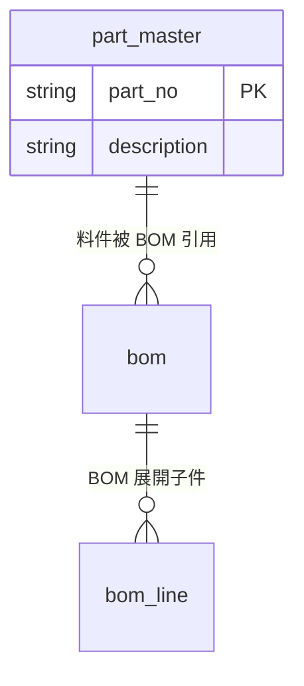

# reference：ERD → `config/<域>/erd/<名>.mmd`

沿用 `dataval/er_diagram.py` 支援的 Mermaid `erDiagram` 子集。ER 關係只是**結構
關聯**,不是已證實的資料流向;引擎會把它當 lineage 顧問候選,不會當已確認血緣。

## Grammar



- 檔頭必須有 `erDiagram`。
- 關聯行:`左實體 基數--基數 右實體 : "說明"`。基數用 mermaid 記號:
  `||`(剛好一)、`o{` / `}o`(零或多)、`|{` / `}|`(一或多)。
- entity 區塊(選填,有欄位細節時才寫):`型別 欄名 [PK|FK|UK]`,一行一欄,
  以 `}` 結尾。

## 落地

寫到 `config/<域>/erd/<描述性檔名>.mmd`。域取自資料所屬領域(BLM/SCM/PLM/FCM/
CRM/Common)。

## 自我驗證(必跑,errors 必須為空陣列)

```bash
.venv/bin/python -c "
from dataval.er_diagram import parse_mermaid
import pathlib
r = parse_mermaid(pathlib.Path('<path>').read_text())
print('errors:', r['errors'])
print('entities:', list(r['entities']))
print('relationships:', len(r['relationships']))
"
```

`errors` 非空代表某行無法解析(常見:漏 `erDiagram` 標頭、entity 少 `}`、基數
記號打錯)。修到 `errors == []` 為止。
